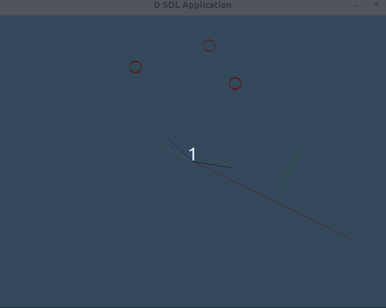

# Math Playground and Code Review

> "See the results"

# Resources to help

Provided below are a list of curated resources to help you complete the task(s) below. Consult them (read them, or do ctrl+f for keywords) if you get stuck.

| D Programming Related Links                         | Description                       |
| --------------------------------------------------  | --------------------------------- |
| [My D Youtube Series](https://www.youtube.com/playlist?list=PLvv0ScY6vfd9Fso-3cB4CGnSlW0E4btJV) | My video series playlist for learning D Lang. |
| [DLang Phobos Standard Library Index](https://dlang.org/phobos/index.html)  | The Phobos Runtime Library (i.e. standard library of code.)
| [D Language Tour](https://tour.dlang.org/)           | Nice introduction to the D Language with samples you can run in the browser. |
| [Programming in D](https://ddili.org/ders/d.en/)     | Freely available D language programming book |
| [My SDL Playlist](https://www.youtube.com/playlist?list=PLvv0ScY6vfd-p1gSnbQhY7vMe2rng0IL0)     | My SDL Playlist |

## Description

There is no real programming work to be done for this portion of the assignment -- hurray? Well, almost -- there is some reading below! 

Otherwise, I thught passing unit tests in the previous portion was quite anti-climatic. All that work for a "1/1 Module Unit Tests Passed" message is not that satisfying. Let's see some things move around -- that's the purpose of this section of the assignment, to otherise give you some confidence that things are working.

## Dub

For this part of the project, I have modified the dub.json file bring in your math library from the part0 directory. This will allow us to use the 'vec2' module and associated types defined. You wil observe a dependency in this folders dub.json that otherwise brings in part0.

```json
"part0":{
    "path": "./../part0"
}
```

Note: For the purpose of a course (and grading), I may sometimes ask you to copy the ve2.d math library, or otherwise use it in a future assignment. In practice, for your final project you might just have a 'common' folder where modules are shared amongst the game, game editors, etc.

## World Coordinates

In this portion of the assignment you'll observe that my coordinate system is not always using screen space (i.e. the top-left corner is not always located at (x=0,y=0) )). Instead however, we can draw on our screen in a regular cartesian coordinate system (i.e. The origin (0,0) is now the middle of the screen). It will be more convenient later on to transform points if we can work in world space. In fact, we can normalize our world coordinates between the value (-1.0,1.0) on the x-axis, and (-1.0,1.0) on the y-axis if we wanted. The point is, we are taking control, and it will be convenient later on for composing more interesting transformations (and personally, it's confusing to have to decrement 'y' screen coordiantes to watch a sprite move up!).

- **World space** is the global coordinate system in the world.
- **Screen Space** is the pixel location on the screen.

Supplied in this portion of the assignment are some helper functions for converting the spaces.

```d
	// Supply a 'screen' or 'pixel' location in the window, and get
	// back a world location
	Vec2f ScreenToWorld(float x, float y, float w, float h){
		Vec2f transform;            

		float middleWidth = w/2.0;
		float middleHeight = h/2.0;

		transform.x = cast(int)((x - middleWidth));
		transform.y = cast(int)((middleHeight - y));

		return transform;
	}

	// w = width of window
	// h = height of window
	// x = screen pixel coordinate
	// y = screen pixel coordinate y location
	Vec2f WorldToScreenCoordinates(float x, float y, float w, float h){
		Vec2f transform;            

		float middleWidth = w/2.0;
		float middleHeight = h/2.0;

		transform.x = cast(int)((middleWidth + x));
		transform.y = cast(int)((middleHeight - y));

		return transform;
	}
```

Another note, is that you'll even see we want to replace how SDL works with its drawline function. We'll convert points before drawing to make sure we can simply draw in world space.

```d
	// Handy function that maps our world coordinates that we supply back to
	// screen coordinates. 
	// We use this function whenever we want to draw something to the screen where 
	// we are already in world coordinates.
	auto DrawLine(Vec2f a, Vec2f b) {
		a = WorldToScreenCoordinates(a.x,a.y,640,480);
		b = WorldToScreenCoordinates(b.x,b.y,640,480);
		SDL_RenderDrawLine(mRenderer,cast(int)a.x,cast(int)a.y,cast(int)b.x,cast(int)b.y); 
	}
```

**Note**: There's nothing wrong with mixing coordinate spaces. For instance, when you draw a user interface, just go ahead an draw using SDL_RenderDrawLine and use the screen coordinates. However, when you want to draw a little dialog box over a character in a game, that should most likely be done in world space.

## What you'll see when your math library works

* The red line is a spinning axis -- just to make things more interesting using polar coordinates.
* The green line is the normal to the 'red line'. I've centered it because it looks nicer.
* The white line is the projection of the vector created from the mouse to the origin onto the spinning axis.
  	* Depending on how you position your mouse, the projection (which you can think of as a shadow) will change.
* The blue line is otherwisie where your mouse is -- the vector created from the blue line is where your mouse is extending to the origin.
* The black line is the 'reflected vector' across the red lines surface normal.
  	* Note: I did not center it, because I thought it was equally clear.
* The circles are otherwise created when you 'click' your mouse.
  	* 



## Exploring the code and summarizing (some) things we have learned so far

The other interesting portion of this assignment is I've pulled together a bunch of sample code that we have previously seen. I hope it will be of use, and you can start to see how an 'engine' is forming here.

We have:

- Game Object abstraction
	- A game object otherwise holds 'Components' -- with an example 'ComponentCircleCollider'
	- The Component Pattern example is provided
- Factory
  	- This is ultimately how we'll want to create objects
- Game Loop abstraction
  	- Ultimately providing
- Support Systems
  	- i.e. Our libraries like the math library we just implemented.

We are missing:

- Callbacks (i.e. ability to add functionality...well anywhere)
  	- At the least we'll want this in our game loop, but we can even have callbacks on GameObjects if we wanted.
- Frame Capping and Frame Independent Movement
  	- You could easily add frame capping in a few lines of code otherwise.
- Sprites and Sprite Animation
  	- You'll want to otherwise consider if static sprites and animated sprites are different components.

We've still got more things to add, but I hope this gives you a good 'mental model' otherwise of where we are in the course.

## How to compile and run your program

1. You can use simply run `dub` file to build and run the project.
   - Note: `dub` by default does a debug build.
   - Don't forget to use [gdb](https://www.youtube.com/watch?v=NWsZrN7gXYg) or [lldb](https://www.youtube.com/watch?v=drzvDkU-H54) if you run into errors!

# Submission/Deliverables

### Submission

- Commit all of your files to github, including any additional files you create.
- Do not commit any binary files unless told to do so.
- Do not commit any 'data' files generated when executing a binary.

### Deliverables

- Your programs functionality *should just work* and utilize your math library from the previous part.

# Going Further

An optional task(if any) that will reinforce your learning throughout the semester--this is not graded.

1. I decided not to do much with the 'circles' that you can create when you click.
	- However -- a good experiment would be to also implement an 'intersect line' collision function with circles.
 	- You could then reflect the circles off of the rotating axis wherever the collision occured in world space to bounce the circles around.
	- And otherwise, you might want the circles to be destroyed or recycled (note: we'll talk about object pools later) after they go off screen.
 
# F.A.Q. (Instructor Anticipated Questions)

1. Q: Can I refactor this demo?
	- A: Sure, but I want to see: normal, reflect, dot, project, used at a minimum.
	- A: I'm also likely to otherwise still try out the sample program to see if it works as expected, but otherwise feel free to try something new!
